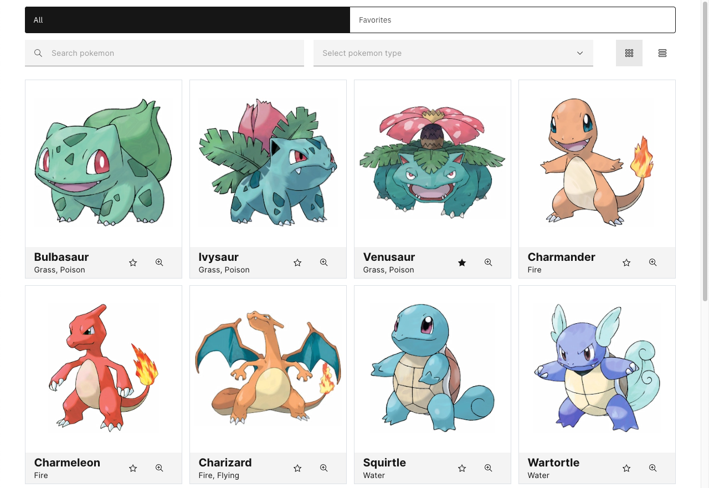
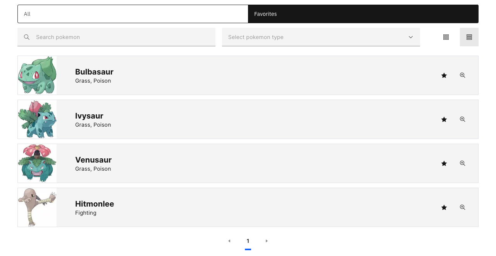
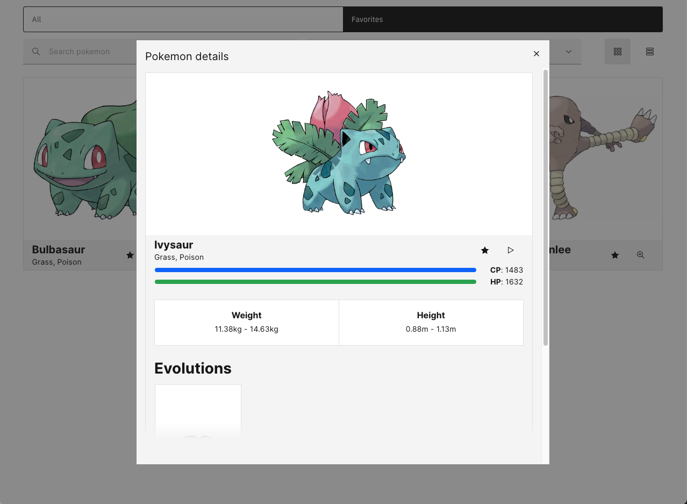
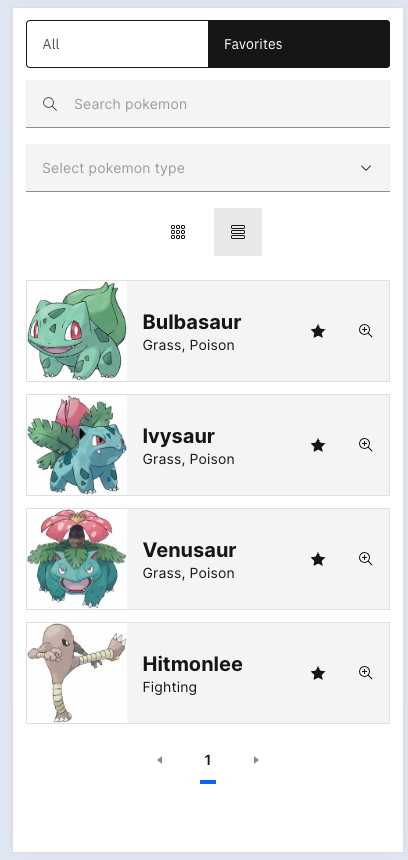
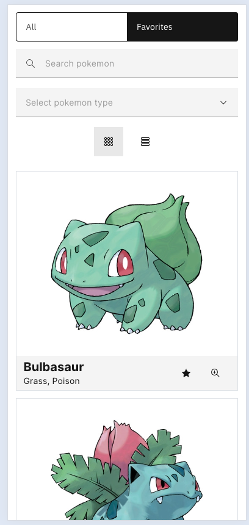
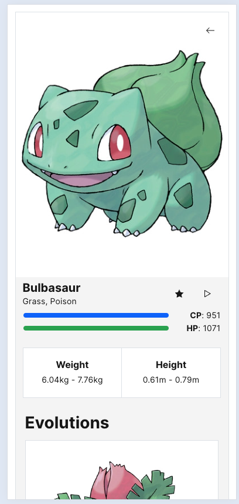

# Pokedex frontend code challenge

## Introduction

This is my take on the frontend code challenge for frontend job position I applied for. The challenge was to build a small Pokedex application with following features:

- Search for Pokemon by text
- Filter Pokemon by type using a dropdown
- Add and remove a Pokemon to and from your Favorites by clicking the heart icon
- Use tabs to switch between `All` Pokemon and `Favorite` Pokemon views
- Change the view from either a grid or list
- View Pokemon details using a `/:name` route
- Clicking on a Pokemon image or name should navigate to the above route to view the Pokemon details
- Show pokemon details in a modal
- Play pokemon sound on details page
- Show toast notifications when adding or removing a Pokemon to and from your Favorites
- Paginated list to handle on-demand data-fetching for the long list of Pokemon
- Responsive design
- Go back button on details page
- Error boundary page (for missing backend API)

## Getting Started

Following instructions will get you the project up and running on your local machine for development and testing purposes.

### Prerequisites

What things you need to install the software and how to install them:

- Node.js (v21)
- yarn (v1.22.xx)

### Installing

This is how you run app in development mode:

1. Clone the repo: `git clone git@github.com:jbutko/pokemons-code-challenge.git`
2. Move to frontend project directory: `cd project/frontend`
3. Install dependencies: `yarn`
4. Move to backend project directory: `cd project/backend`
5. Install dependencies: `npm i`
6. Start the backend server: `npm start`
7. Start the development server: `cd frontend && yarn dev`

## Built With

- [React](https://reactjs.org/) - The web framework used
- [Next.js](https://nextjs.org/) - Server-side rendering and app routing approach (> v14 used)
- [TypeScript](https://www.typescriptlang.org/)
- [Carbon Design System](https://www.carbondesignsystem.com/) - UI/UX design system
- [Apollo Client](https://www.apollographql.com/docs/react/) - GraphQL client
- [SASS](https://sass-lang.com/) - CSS preprocessor

## App architecture and design

The app is written in Typescript and built using Next.js framework with Apollo Client for fetching data from the GraphQL server. The app is built with app router approach.

### State management

The app uses URL search parameters for managing the state of the app, such as the type of view, search query or active list type. The advantage of this approach is that the app is shareable and the state can be easily restored by sharing the URL. However this approach has its limitations, in more complex apps it would be better to use a state management library like Zustand.

### CSS

The app is responsive and should work on all devices. The app uses SASS preprocessor with module approach for styles. The app uses carbon design Grid and Column components for page and components layout. The app uses SASS variables from carbon design for colors, spacing and breakpoints.

### Components

The app is divided into components, each component has its own folder with styles. Components are divided into atoms, molecules and organisms based on [Atomic Design methodology](https://atomicdesign.bradfrost.com/chapter-2/). The smallest building blocks are atoms, which are used to build molecules and more complex organisms. Molecules are used to build organisms.

### Hooks

The app uses custom hooks for showing toast notifications and for managing state via URL search parameters.

### Previews

#### Grid view

#### List view

#### Modal window

#### Responsive screens

  
   
  

## Disclaimer

I was working only on the frontend part of the app, the backend part was provided by the company. The backend is a simple GraphQL server that provides data for the Pokedex app.
